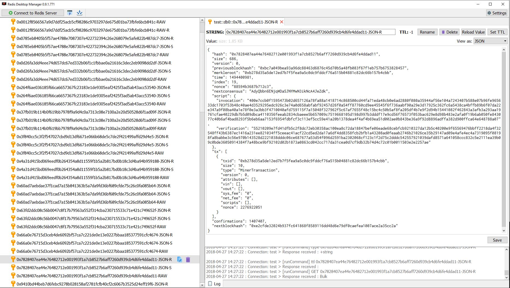
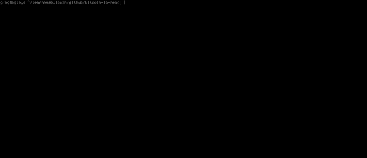

ArtaxECP (Artax Encryption Cache Persistence) (Compilation of XAX>BTC2Neo4j and Custom Artax Redis)

Both components should also work in Windows and Mac OSX but testing and work still progresses in the open-source community. Work of many, on-going crypto community, open-source forks and projects amalgamated.


#### Exploring the Artax Blockchain with the Redis Desktop Manager 



## Summary.

This repo is in two parts. First is a custom instance of a redis cache persistence server designed to be integrated with the Artax Blockchain.

Second is a script which _runs through_ the **artax blockchain** and inserts it in to a **Neo4j graph database**.
This script written by Greg Walker is Segwit Ready.
 

**Important:**

* **The resulting Neo4j database (which will run along side the Redis db) is roughly _6x_ the size of the blockchain.** So if the blockchain gets to 2GB, your Neo4j database will be **12GB**.

## Install pt 1.

1. Install node.js

```bash
sudo apt install curl
curl -sL https://deb.nodesource.com/setup_10.x | sudo bash -
sudo apt install nodejs
```
2. Clone the repo.
3. Cd into the Artaxdb folder.
4. Execute the command ``` node ArtaxCPServer.js rdb.txt ```
5. From client
 
Type the command ``` telnet localhost 15000 ```
Commands for input, adding, range and removal- SET, GET, ZADD, ZCOUNT, ZRANGE, ZCARD.
    3. For example. Exceute it like this. Press enter after each command.
        1. ``` SET foo artaxblocks ```
        2. ``` GET foo ``` 


### Install pt 2.

**Linux 18.10 (Ubuntu) Required**.

This script makes use of the following software: 

1. **[Artax Core](https://artaxcoin.org)**

```bash
sudo add-apt-repository ppa:bitcoin/bitcoin
sudo apt update
sudo wget https://github.com/artaxcommittee/Artax/releases/download/v2.0.0.3/Artax-2.0.0.3-x86_64-linux.tar.gz
tar -czvf Artax-2.0.0.3-x86_64-linux.tar.gz
```

2. **[Neo4j 3.0+](https://neo4j.com/)**

```bash
sudo add-apt-repository ppa:webupd8team/java
sudo apt update
sudo apt install oracle-java8-installer

wget -O - https://debian.neo4j.org/neotechnology.gpg.key | sudo apt-key add -
echo 'deb https://debian.neo4j.org/repo stable/' | sudo tee /etc/apt/sources.list.d/neo4j.list
sudo apt update && sudo apt install neo4j
```

3. **[PHP 7.2+](http://php.net/)** - The main script and it's library functions are written in PHP.

```bash
# The extra php7.0-* libraries are needed for this script to run.
sudo apt install php7.2 php7.2-dev php7.2-gmp php7.2-curl php7.2-bcmath php7.2-mbstring
```

4. **[Redis 5.0.3+](https://redis.io/)** - This is used for storing the state of the import, so that the script can be stopped and started at any time.

```bash
sudo apt install build-essential
sudo apt install redis-server
```

### Dependencies.

**1. [neo4j-php-client](https://github.com/graphaware/neo4j-php-client)** (install via [composer](https://getcomposer.org/doc/00-intro.md)).

This is the driver that allows PHP to connect to your Neo4j database. A `composer.json` file is included, so navigate to the project's home directory and install it with:

```bash
composer install
```

**2. [phpredis](https://github.com/phpredis/phpredis)**

This allows PHP to connect to Redis. These instructions should install the version needed for _PHP7_ (which is different to the default installation instructions that come with phpredis, which is aimed at PHP5).

```bash
# Install phpredis
sudo apt install php-redis
```

### Config.

The `config.php` file contains all the configuration settings. You probably only need to change:

1. The location of your `~/.artax/blocks` folder 
2. Your Neo4j username and password.

```php
define("BLOCKS", '/home/user/.artax/blocks'); // the location of the blk.dat files you want to read
define("TESTNET", false); // are you reading blk.dat files from Artax's testnet?

define("NEO4J_USER", 'neo4j');
define("NEO4J_PASS", 'neo4j');
define("NEO4J_IP", 'localhost');    
define("NEO4J_PORT", '7687'); // this is the port used for the bolt protocol

define("REDIS_IP", 'localhost');    
define("REDIS_PORT", '6379');

```

## Run.

Make sure Neo4j is running (`sudo service neo4j start`), then start running the script with:

```
php main.php
```

This will start importing in to Neo4j, printing out the results as it goes.

[](docs/images/stdout.gif)

Here's an [annotated explanation of the results](docs/images/stdout-explained.png)

### Tip:

**You can stop and restart the script at any time, as the script stores its position using Redis.**

The script sets the following keys in Redis:

* `ArtaxCP` - This stores the number of the current blk.dat file, and it's position in that file.
* `ArtaxCP:orphans` - This stores the blockhashes of orphan blocks. You see, the blocks in the blk.dat files are not stored in order (based on their height), so by saving blocks that we cannot calculate a height for yet (because we haven't encountered the block it builds upon), we are able set the height later on.
* `ArtaxCP:tip` - This is the height of the current longest chain we have got in Neo4j. It's not needed for the script to work, but it's useful for seeing the progress of the script.
* `ArtaxCP:log` - Logs showing the amount of time that the blkXXXXX.dat files took to be imported.

When Redis is installed, you can look at each of these with:

```bash
redis-cli hgetall ArtaxCP
redis-cli hgetall ArtaxCP:orphans
redis-cli hgetall ArtaxCP:tip
redis-cli hgetall ArtaxCP:log
```

### Neo4j's _Bulk Import Tool_

The Neo4j bulk import tool can also be used to acheieve a similar income but not as comprehensive with the information or as up-to-date

A script would involve writing another tool for a bulk import. 

Full Credit to Greg Walker for the scripting work. Please contribute here where you can.
