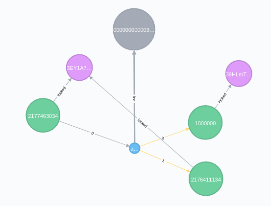
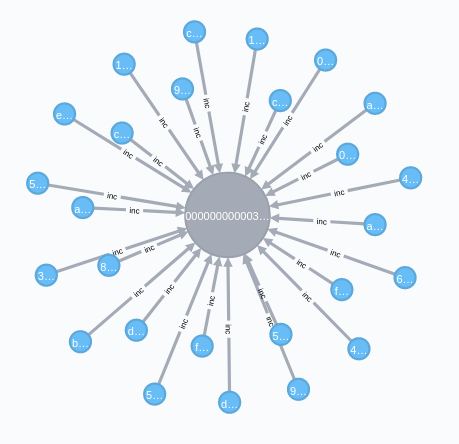
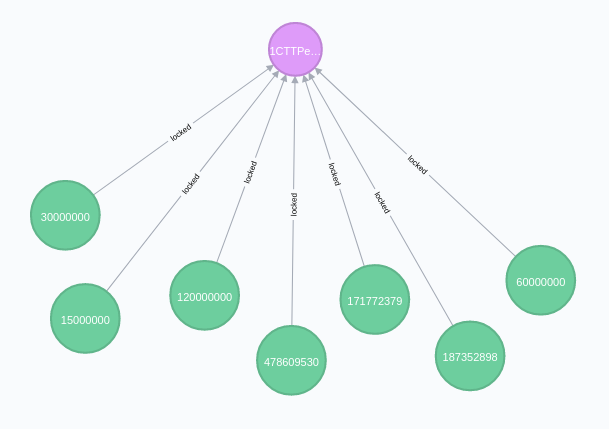
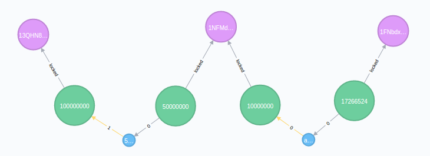

# Cypher Queries

Here are some example Cypher queries for getting useful data out of the Artax Neo4j database.

## Blockchain


```
MATCH (start :block {height:100})-[chain :chain*0..4]->(block :block)-[:coinbase]->(cb :output)-[:in]->(coinbasetx :tx)
RETURN block, cb
```

Return a chain of blocks from a particular starting height, along with the coinbase (containing the block reward) from each block.

## Transaction.



```
MATCH (inputs)-[:in]->(tx:tx)-[:out]->(outputs)
WHERE tx.txid='$txid'
OPTIONAL MATCH (inputs)-[:locked]->(inputsaddresses)
OPTIONAL MATCH (outputs)-[:locked]->(outputsaddresses)
OPTIONAL MATCH (tx)-[:inc]->(block)
RETURN inputs, tx, outputs, block, inputsaddresses, outputsaddresses
```

This will give you a transaction node with all of its inputs and all of its outputs, and any addresses those outputs are locked to. It will also return the block(s) the transaction is included in.

_Note: A transaction can be included in more than one block; in a block on the main chain, and in a block on a fork of the main chain. This typically happens when two different blocks are mined at the same time._

## Block



```
MATCH (block :block)<-[:inc]-(tx :tx)
WHERE block.hash='$blockhash'
RETURN block, tx
```

This returns a block with all the transactions that are included in it.

## Address



```
MATCH (address :address)<-[:locked]-(output :output)
WHERE address.address='$address'
RETURN address, output
```

Show all of the outputs that have been locked to an address.

_Note: Addresses are found from the scriptSig field of an output._

### Address Balance

```
MATCH (address :address)<-[:locked]-(output :output) 
WHERE address.address='$address' 
AND NOT (output)-[:in]->(:tx) 
RETURN sum(output.value) as balance
```

You can calculate the balance of an address by summing the values of the _unspent_ outputs that are locked to an address.

_Note: An unspent output is one that has not been included as an input in another transaction (`AND NOT (output)-[:in]->(:tx)`)._

## Paths

### Between Outputs


```
MATCH (start :output {index:'$txid:vout'}), (end :output {index:'$txid:out'})
MATCH path=shortestPath( (start)-[:in|:out*]-(end) )
RETURN path
```

An output is like a single payment of artaxs. This query allows you to see if two payments (outputs) are connected by a series of transactions.

_Note: Each output has a unique index property, which is a combination of the ID of the transaction it was created in (txid) and, and the output number from that transaction (vout). So an index would look something like this: `302c4757c5eb9f1633d5d076f150d320b8418f3a6295f5e87fc1805b9440cbc0:1`._

### Between Addresses



```
MATCH (start :address {address:'$address1'}), (end :address {address:'$address2'})
MATCH path=shortestPath( (start)-[:in|:out|:locked*]-(end) )
RETURN path
```

This query allows you to see if two address are connected by a series of transactions. It also returns a path if there are common intermediary addresses.

## Historical Analyses

### First Transctions

The following query finds all non-coinbase transactions in the first 1000 blocks.

```cypher
MATCH (block:block)-[:inc]-(tx:tx)
WHERE block.height < 1000
  AND not exists((tx)<-[:in]-(:coinbase))
RETURN
  block.height AS block,
  tx.txid AS transaction,
  size((tx)<-[:in]-()) AS inputs,
  size((tx)-[:out]->()) AS outputs,
  tx.fee / tx.size AS fee_satoshis_per_byte
ORDER BY block
```

The first few rows returned are:

| block | transaction | inputs | outputs | fee_satoshis_per_byte |
|-------|-------------|--------|---------|-----------------------|
| 170 | f4184fc596403b9d638783cf57adfe4c75c605f6356fbc91338530e9831e9e16 | 1 | 2 | 0 |
| 181 | a16f3ce4dd5deb92d98ef5cf8afeaf0775ebca408f708b2146c4fb42b41e14be | 1 | 2 | 0 |
| 182 | 591e91f809d716912ca1d4a9295e70c3e78bab077683f79350f101da64588073 | 1 | 2 | 0 |
